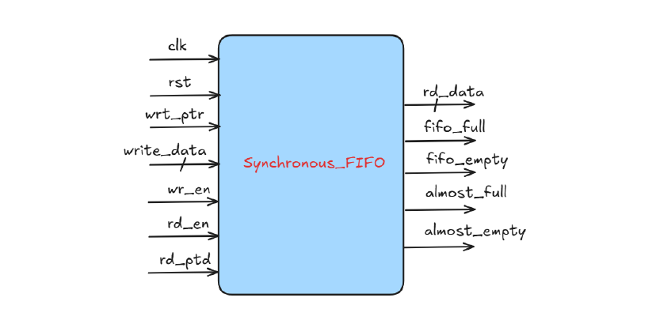

# Synchronous FIFO Design and Verification using Cocotb

This project implements a **parameterized Synchronous FIFO in Verilog** and verifies its functionality using **Cocotb**, a Python-based hardware verification framework.

The repository demonstrates a complete **RTL → Verification → Simulation workflow**, including architecture design, Python testbench development, and waveform debugging.

---

## 🎞️ Project Demo

This video demonstrates the FIFO RTL implementation, Cocotb testbench execution, and waveform analysis.

https://github.com/user-attachments/assets/46b191b6-0d6a-4ada-a401-aeee33d3281d


---

## 🏗 FIFO Architecture



The synchronous FIFO consists of the following components:

- **Memory Array** – Stores FIFO data elements  
- **Write Pointer (`wr_ptr`)** – Points to the next write location  
- **Read Pointer (`rd_ptr`)** – Points to the next read location  
- **FIFO Counter** – Tracks number of stored entries  
- **Status Logic** – Generates FIFO status flags  

---

## ⚙️ FIFO Design Features

- Parameterized **data width**
- Parameterized **FIFO depth**
- Supports **simultaneous read and write**
- Implements **status flags**

| Signal | Description |
|------|-------------|
| `full` | FIFO cannot accept new data |
| `empty` | FIFO has no data to read |
| `almost_full` | FIFO nearly full |
| `almost_empty` | FIFO nearly empty |

---

## 🧠 Design Logic

### Write Operation

Data is written when:

```
wr_en && !full
```

- Data is stored in FIFO memory
- Write pointer increments

### Read Operation

Data is read when:

```
rd_en && !empty
```

- Data is fetched from FIFO memory
- Read pointer increments

### FIFO Counter Update

| Operation | Counter Change |
|----------|---------------|
| Write only | +1 |
| Read only | -1 |
| Read + Write | No change |

---

## 🧪 Verification using Cocotb

Verification is implemented using **Cocotb**, allowing hardware testbenches to be written in **Python**.

Testbench Flow:

1. Reset the FIFO  
2. Write multiple values to the FIFO  
3. Read values sequentially  
4. Verify data order using assertions  

Example output log:

```
READ = 0
READ = 1
READ = 2
READ = 3
```

Assertions ensure the FIFO maintains **correct ordering (FIFO property)**.

---

## 📊 Simulation Waveform


The waveform verifies:

- Correct write operations
- Correct read operations
- Pointer updates
- FIFO counter behavior
- Proper `full` and `empty` flag generation

---

## 📁 Repository Structure

```
sync_fifo_cocotb
│
├── docs/                 # Documentation and diagrams
│   ├── fifo_architecture.png
│   └── fifo_notes.pdf
│
├── hdl/                  # RTL design
│   └── sync_fifo.v
│
├── dv/                   # Cocotb verification environment
│   └── test_fifo.py
│
├── sim/                  # Simulation setup
│   └── Makefile
│
└── README.md
```

---

## ▶️ Running the Simulation

This project uses **Verilator + Cocotb**.

### 1️⃣ Install Dependencies

Install Python packages:

```
pip install cocotb cocotb-test
```

Install Verilator:

```
sudo apt install verilator
```

Verify installation:

```
verilator --version
```

---

### 2️⃣ Run Simulation

Navigate to the project root and run:

```
make -C sim SIM=verilator
```

This command will:

- Compile Verilog RTL using **Verilator**
- Execute the **Cocotb testbench**
- Generate simulation logs
- Create waveform dump (`dump.vcd`)

---

### 3️⃣ View Waveform

Open the waveform using **GTKWave**:

```
gtkwave dump.vcd
```

---

## 📚 Learning Resources

This repository also contains:

- Detailed FIFO design notes
- Architecture diagram
- Video explanation with waveform walkthrough

These resources help understand FIFO design and verification flow.

---

## 🚀 Skills Demonstrated

- Verilog RTL Design
- FIFO Architecture
- Python-based Hardware Verification
- Cocotb Testbench Development
- Verilator Simulation
- Assertion-based Verification
- Waveform Debugging
- Hardware Design Documentation

---

## 👨‍💻 Author

**Harshal Dhage**

Electronics and Communication Engineering Graduate  
Interested in **CPU Architecture, RTL Design, and Verification**

LinkedIn:  
https://www.linkedin.com/in/harshaldhage
